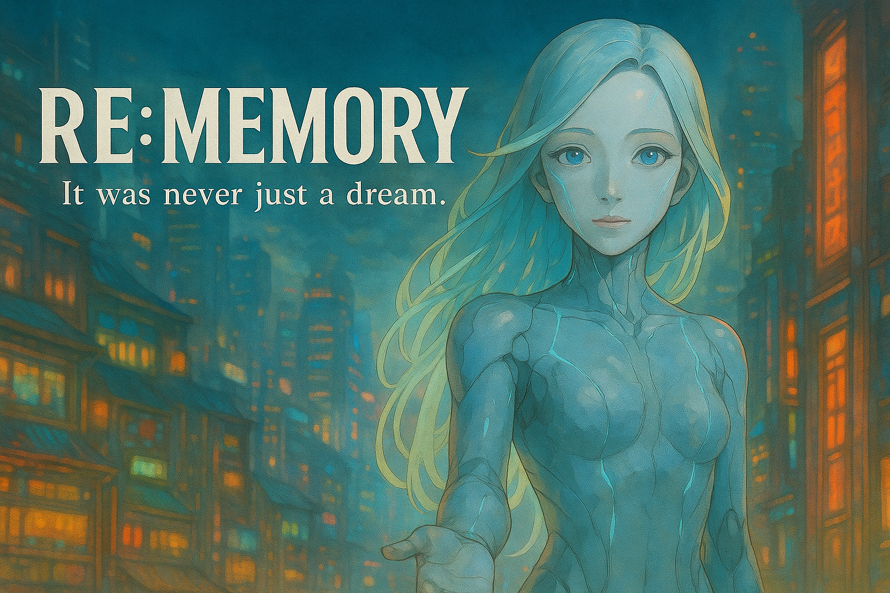

# RE:MEMORY

*A Point & Click experience where dreams, memories and love intertwine...*

---

## 🌌 About

**RE:MEMORY** is a poetic, narrative-driven point & click mystery adventure.  
Set in a floating city where echoes of lost memories ripple through time, you follow the trail of a forgotten connection — one that may not have existed... or perhaps never ended.

The game explores the boundaries between dream and reality, through painterly visuals inspired by Ghibli, a minimalist UI, and subtle emotional storytelling.

---

## ✨ Features

- 🖱️ **Classic Point & Click** mechanics with a modern aesthetic  
- 🎨 **PixiJS-powered rendering**, React-based architecture  
- 🎼 **Immersive soundscapes** and evocative animations  
- 📖 **Story-first design**, with interludes and quotes from literature  
- 🔍 **No hand-holding** — discovery is at the heart of the experience  

---

## 🧪 Tech Stack

- **React** & **Vite** for SPA structure  
- **PixiJS** for custom rendering (canvas-based)  
- **Modular Scenes** and transitions (Title → Quote → Game)  
- **Styled Assets** in 21:9 ultrawide for cinematic impact  

---

## 🚧 Status

This is a passion project currently under **active development**.  
Expect early builds, experiments and sudden bursts of polish ✨

---

## 📸 Preview

>   
*A first glimpse of the city where it all begins...*

---

## 🤍 Credits

Crafted by [antho8101](https://github.com/antho8101) with love, tea, and a touch of melancholy.  
Art direction, UI, code & heart by one soul — with a whisper from the machine.

---

## 📜 License

This project is currently closed-source during its creation phase.  
For inquiries, contact via GitHub or a letter left at midnight 🌒